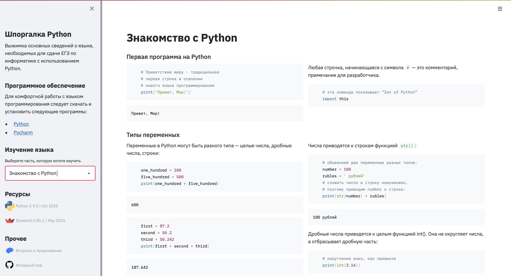

# python-basics-cheatsheet

A cheat sheet for Python 3 language.

## Versioning

- Based on Python 3.9.5
- Made with Python 3.9.5 and Streamlit 0.81.1

## Requirements

A clean venv with just pip and then Streamlit

## Deployments

[Python Basics Cheat Sheet - Heroku](https://python-basics-cheatsheet.herokuapp.com)

[Python Basics Cheat Sheet - Streamlit](https://share.streamlit.io/lovesolaristics/python-basics-cheatsheet/app.py)

## Show me

